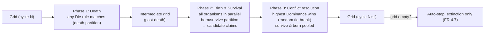

# RFC-004: Rules Engine & Simulation Architecture

**Status:** Approved
**Date:** 2026-06-16
**Approved:** 2026-07-13
**Author:** Architecture Team

## Summary

This RFC defines two cleanly separated pieces of domain logic and the generic utility that
underpins them:

1. **A generic, functional Rules Engine** — a small, domain-agnostic library that answers one
   question: *given a subject, which configured rule does it satisfy first?* It knows about subjects,
   conditions, rules, and rule sets — and nothing about cells, organisms, grids, or actions.
2. **A Game of Life rules layer** — the domain-specific binding that defines the **Cell** subject,
   models an organism's **Survival Rules** directly on top of the generic engine, and resolves a
   cell's **action** (Born / Survive / Die).
3. **A Simulation Engine** — an orchestration layer that drives the Petri Dish forward in time using
   a **pluggable evaluation strategy** (the three-phase model is the first such strategy),
   delegating every per-cell decision to the rules layer.

The design is **deliberately functional, not object-oriented: no classes, no inheritance, no
`this`.** Behaviour is built from plain immutable data (discriminated unions), pure functions, and
function dictionaries. Classic design-pattern *intent* (Strategy, Composite, Adapter, Factory,
Dependency Injection) is realized functionally, and the layering enforces SOLID boundaries — most
importantly the **Dependency Inversion** between the simulation strategy and the rules layer, and the
**Single Responsibility** split between "deciding" (rules) and "stepping" (simulation).

Persisted rules are a versioned JSON structure validated by **Zod** schemas (consistent with
RFC-001). Crucially, the JSON stored for an organism's survival rules **is** the generic engine's own
structure — no mapping layer between what is persisted and what the engine consumes.

## Links

- [Product Requirements Document](/docs/planning-artifacts/prds/prd-GameOfLife-2026-05-26/prd.md) — FR-2.5 (Survival Rules), FR-2.6 (rule ordering), FR-5 (Simulation Engine), NFR-1.1, NFR-5.1, NFR-5.2
- [RFC-001: Multi-Mode Architecture](/docs/planning-artifacts/rfcs/RFC-001-multi-mode-architecture.md) — `Organism`/`Battle` domain entities, Zod schemas, Repository pattern
- [RFC-002: Grid Rendering Technology](/docs/planning-artifacts/rfcs/RFC-002-grid-rendering-technology.md) — grid representation, 60 FPS budget
- [Main Architecture Document](/docs/planning-artifacts/architecture.md)

## Overview

### Purpose & Goals

**Primary Purpose:**
Design a rules/simulation capability that is **simple for the MVP**, **fast enough for 60 FPS on a
6,000-cell grid** (NFR-1.1), **provably correct** (NFR-5.1, 90%+ coverage), and **open for
extension** — new condition properties, operators, pattern types, subjects, *and* simulation
strategies can be added later without rewrites or breaking saved data.

**A deliberate separation: generic engine vs. domain implementation.**
A core goal is to **separate the reusable Rules Engine from the Game-of-Life-specific logic**, and to
**separate the Rules Engine from the Simulation Engine entirely**, because these are two distinct
domains:

- *"Which rule does this subject satisfy first?"* — a **generic** matching concern (the Rules Engine).
- *"What does an organism do to a cell, and how does the whole grid advance one cycle?"* — a
  **domain + orchestration** concern (the Game of Life rules layer and the Simulation Engine).

**The generic engine has three nested levels** (with a fourth reserved for the future):

| Level | Generic term | Game of Life term | PRD wording |
|------:|--------------|-------------------|-------------|
| innermost | **`Condition`** | `Condition` | "Condition" (e.g. *Neighbour Count = 3*) |
| middle | **`Rule`** (conditions + payload) | `SurvivalRule` (payload = `{ summary, action }`) | "Survival Rule" (e.g. *Born*) |
| outer | **`RuleSet`** (ordered `Rule[]`) | `SurvivalRules` (owned by an Organism) | "Survival Rules" (the list) |
| *(future)* | *`RuleSetCollection`* (ordered `RuleSet[]`) | *reserved — e.g. a Battle-level grouping* | — |

So an Organism's **`SurvivalRules`** *is* a generic **`RuleSet`**; each **`SurvivalRule`** *is* a
generic **`Rule`**; each is built from generic **`Condition`s**. The engine returns *which `Rule`*
won; the domain layer reads what it needs from that winner's `payload`. The Simulation Engine sits on
top and never touches rule internals — it only asks the rules layer for a decision.

**Goals:**
1. **Domain-agnostic core:** the Rules Engine compiles, runs, and is tested with **zero** references
   to cells, organisms, grids, or actions.
2. **Functional core:** no classes; pure functions + discriminated unions + function dictionaries.
3. **Generic resolution, specific interpretation:** a `RuleSet` resolves to the **first winning
   `Rule`**; the domain layer extracts what it needs from that rule's `payload`.
4. **Two engines, two domains:** Rules (deciding) and Simulation (stepping) are separate packages
   with a one-directional dependency.
5. **No-mapping persistence:** the JSON under `survivalRules` is exactly the generic `RuleSet`
   structure — persisted data flows into the engine without translation.
6. **Open/Closed via additive registries:** adding a property, operator, pattern type, subject, or
   strategy is an additive lookup-table entry — never a modification of existing logic.
7. **Backward compatibility:** older saved rules load and evaluate correctly — upgraded by RFC-006's
   single `formatVersion` migration chain at the persistence boundary (arch Decision I).
8. **Performance:** the abstraction compiles away to a tight inner loop — numeric per-cell state, no
   per-cell allocation or dynamic dispatch in the hot path (NFR-1.1).
9. **MVP discipline:** implement only the operators/properties the PRD requires, and **hardcode** the
   single simulation strategy in code (no strategy UI yet — see Part 3).

### Background

**What the PRD requires (FR-2.5).** Each organism owns an ordered list of **Survival Rules**. Each
rule has a **Summary** (user text), an **Action** (`Born`, `Die`, or `Survive`), and one or more
**Conditions**, each a *(Property, Operator, Pattern)* triple combined with **AND** logic. Available
**Properties (MVP):** Cell State, Organism Type, Age of Cell, Neighbor Count, Occupant Neighbor
Count. Available **Operators (MVP):** `=`, `>`, `<`, `>=`, `<=`, `range`. Rules are **manually ordered
per organism** (FR-2.6); that order is the evaluation priority.

**What the PRD requires (FR-5).** Each cycle evaluates the whole 100×60 grid in three phases:
Phase 1 **Death**, Phase 2 **Birth & Survival** (all organisms in parallel against the post-death
intermediate grid), Phase 3 **Conflict resolution** by **Dominance** (higher wins; ties broken
randomly). Plus: Moore neighborhood with **hard edges** (FR-5.8/5.9), **cell aging** (FR-5.6), and
**auto-stop on extinction** (FR-4.7).

**Layered architecture (dependencies point downward — DIP):**

```
┌───────────────────────────────────────────────────────────────────────┐
│ Part 3 — SIMULATION ENGINE (orchestration domain)                       │
│   pluggable strategy (three-phase; hardcoded for MVP), grid state,      │
│   time, neighbor topology, conflict resolution, aging, extinction stop  │
│   depends ↓ ONLY on an injected per-cell decision function              │
├───────────────────────────────────────────────────────────────────────┤
│ Part 2 — GAME OF LIFE RULES (rules domain)                              │
│   CellSubject, SurvivalRules (= generic RuleSet), resolveCellAction()   │
│   — reads the Action from the winning Rule's payload                    │
│   depends ↓ on the generic engine                                       │
├───────────────────────────────────────────────────────────────────────┤
│ Part 1 — GENERIC RULES ENGINE (reusable utility)                        │
│   Condition<Props>, Rule<Payload,Props>, RuleSet<Payload,Props>,        │
│   operators, Selectors<S,Props>,                                        │
│   firstSatisfiedBy() → winning Rule                                      │
│   depends on: NOTHING domain-specific                                   │
└───────────────────────────────────────────────────────────────────────┘
```

### High Level Design Proposal

---

## Part 1 — Generic Functional Rules Engine

A reusable, domain-agnostic library. Its three levels — `Condition`, `Rule`, `RuleSet` — know about
subjects, properties, operators, and patterns, and nothing else.

#### 1.1 Data model (plain, immutable, generic)

```ts
// ---- Operators (MVP set) ----------------------------------------------------
// ⚠️ As built (Story 3.1) this is ONE union, not three names: `EqualityOperator = 'eq'` is
// already an arm of `NumericOperator`, so the split names the same six operators and sends
// the reader hunting for a distinction that does not exist. Recorded as an observation, not
// a decision to re-open — the operator SET is unchanged either way.
//   export type Operator = 'eq' | 'gt' | 'lt' | 'gte' | 'lte' | 'range'
export type NumericOperator = 'eq' | 'gt' | 'lt' | 'gte' | 'lte' | 'range'
export type EqualityOperator = 'eq'
export type Operator = NumericOperator | EqualityOperator

// ---- Condition: the atomic predicate ---------------------------------------
// The subject's VALUE (resolved via `property`) is tested against this PATTERN.
//
// ⚠️ AMENDED by M11 (Story 3.1, FD1). This was `Condition<P = unknown>` where `P`
// was the PATTERN type — but the parameter was never supplied at any call site
// (`Rule.conditions` was a bare `Condition[]`, and every §1.4 signature took a
// bare `Condition`), while §1.4 reused the same letter `P` for the PAYLOAD. One
// letter, two meanings, and the pattern one inert. The pattern parameter is
// dropped: `pattern: unknown` already matches the `Predicate` contract §1.2
// declares, and keeps this assignable FROM the concrete §2.4 Condition.
// The parameter it DOES carry, `Props`, threads through `Rule.conditions`.
export interface Condition<Props extends string = string> {
  readonly property: Props      // key resolved by a Selectors<S, Props> dictionary (§1.3)
  readonly operator: Operator
  readonly pattern: unknown     // what the subject's value is compared against
}

// ---- Rule<Payload>: AND-group of Conditions carrying a generic payload ------
// The engine NEVER inspects `payload`; it is opaque domain data returned with
// the winning rule. This is what decouples the engine from "actions".
export interface Rule<Payload = unknown, Props extends string = string> {
  readonly id: string             // opaque, generated — stable identity (§2.4)
  readonly contentHash: string    // deterministic — content-addressing (§2.4)
  readonly conditions: readonly Condition<Props>[]   // AND semantics
  readonly payload: Payload
}

// ---- RuleSet<Payload>: an ORDERED list of Rules ----------------------------
export type RuleSet<Payload = unknown, Props extends string = string> =
  readonly Rule<Payload, Props>[]

// ---- (Future) RuleSetCollection: an ordered list of RuleSets ----------------
// Reserved for a future fourth level (e.g. grouping rule sets). Not in the MVP.
export type RuleSetCollection<Payload = unknown> = readonly RuleSet<Payload>[]
```

#### 1.2 Operators as a Strategy dictionary

Each operator is a pure predicate in a function dictionary keyed by operator id — the functional form
of the Strategy pattern. Only MVP operators are implemented; adding one is a single additive entry
(Open/Closed).

```ts
type Predicate = (value: unknown, pattern: unknown) => boolean   // value = subject's; pattern = condition's

// ⚠️ AMENDED by M12 (Story 3.1). The `as number` casts shown in earlier drafts of this
// RFC are erased at runtime and proved nothing: a Selector<S> returns `unknown` and may
// legitimately yield null/undefined, which JS then COERCES — `null` to 0 (so `null > -1`
// was silently TRUE) and `undefined` to NaN (every comparison silently false). `range`
// destructured its pattern unchecked, so a non-iterable THREW out of the per-cell loop.
// Each predicate now asks whether the comparison is meaningful and returns `false` when
// it is not. This is a `typeof` tag test, NOT a per-cell re-parse — the "types are
// already proven inside the engine, never re-parse per cell" rule stands and there is no
// schema work here. Measured at +0.019 ms/cycle against the 16.7 ms NFR-1.1 budget.
const isNumber = (v: unknown): v is number => typeof v === 'number'

const table = {
  eq:    (v, p) => v === p,                                    // general equality: strings too
  gt:    (v, p) => isNumber(v) && isNumber(p) && v >  p,
  lt:    (v, p) => isNumber(v) && isNumber(p) && v <  p,
  gte:   (v, p) => isNumber(v) && isNumber(p) && v >= p,
  lte:   (v, p) => isNumber(v) && isNumber(p) && v <= p,
  range: (v, p) => {
    if (!isNumber(v) || !Array.isArray(p) || p.length !== 2) return false
    const [lo, hi] = p as [unknown, unknown]
    return isNumber(lo) && isNumber(hi) && v >= lo && v <= hi   // INCLUSIVE both ends
  },
} satisfies Record<Operator, Predicate>

// ⚠️ NULL PROTOTYPE. A plain object literal inherits Object.prototype, so a lookup by an
// operator id outside the six can still RESOLVE — `operators['toString']` is a real
// function — and an `undefined` check in §1.4 does not catch it. `satisfies` above (not an
// annotation here) keeps the exhaustiveness check that makes a seventh operator a build
// failure; annotating only this copy would silently drop it.
const operators: Record<Operator, Predicate> =
  Object.assign(Object.create(null) as Record<Operator, Predicate>, table)
```

#### 1.3 Subjects via injected selectors (Adapter, generic over `S`)

The engine reads a subject's properties through an injected **`Selectors<S, Props>`** dictionary — a record
of pure functions from subject to value. The engine is therefore generic over *any* subject `S`; it
never imports a concrete subject. (This is the seam that lets Part 2 plug in a `CellSubject`, and a
future caller plug in a `BattleSubject`.)

```ts
export type Selector<S> = (subject: S) => unknown

// ⚠️ AMENDED by M11 (Story 3.1). `Selectors<S> = Record<string, Selector<S>>` is TOTAL over
// every string key (with `noUncheckedIndexedAccess` off), so a dictionary missing an entry
// type-checks and the lookup hands back a Selector the runtime does not have. Naming the key
// set makes a missing selector a BUILD error instead. `Props` takes NO default here — a
// default would restore the unsafe form for anyone who says nothing. Condition/Rule/RuleSet
// keep their `string` default: there it widens a property name rather than faking a lookup.
export type Selectors<S, Props extends string> = Readonly<Record<Props, Selector<S>>>
```

#### 1.4 Evaluation — `isSatisfiedBy` (Condition, Rule) and `firstSatisfiedBy` (RuleSet)

```ts
// Condition.isSatisfiedBy → boolean (Specification). value vs. pattern.
// ⚠️ AMENDED by M12 (Story 3.1): both lookups are guarded. Types prove these are total only
// for a FRESHLY TYPE-CHECKED value; a rule deserialized from an older workspace, or built by
// a future non-GoL caller, carries whatever it carries. `Operator` is compile-time only, so a
// retired id (`ne`, valid until Decision C) made `operators[...]` undefined and CALLING it
// threw. `Object.hasOwn` — not `typeof === 'function'` — because a caller's selector
// dictionary is a plain literal that INHERITS Object.prototype: 'toString'/'valueOf'/
// 'hasOwnProperty' resolve to real functions that pass a typeof test and then throw when
// invoked with `this === undefined`. Measured at +0.091 ms/cycle (~0.5% of the NFR-1.1
// budget); the zero-per-cell form is a key sweep at evaluator-COMPILE time (§3.5).
export function conditionIsSatisfiedBy<S, Props extends string>(
  c: Condition<Props>, subject: S, selectors: Selectors<S, Props>,
): boolean {
  if (!Object.hasOwn(selectors, c.property)) return false
  const value = selectors[c.property](subject)
  const predicate = operators[c.operator]
  if (predicate === undefined) return false
  return predicate(value, c.pattern)
}

// Rule.isSatisfiedBy → boolean — all conditions AND'd (Composite; native short-circuit)
export function ruleIsSatisfiedBy<S, Props extends string>(
  rule: Rule<unknown, Props>, subject: S, selectors: Selectors<S, Props>,
): boolean {
  return rule.conditions.every(c => conditionIsSatisfiedBy(c, subject, selectors))
}

// RuleSet — returns the FIRST WINNING Rule (or null). Priority = order.
// Named `firstSatisfiedBy` to make the return type explicit; it generalizes the
// boolean `isSatisfiedBy`. The engine returns the WINNER — it does not interpret it.
// ⚠️ M11: the payload parameter is named `Payload`, not `P` — §1.1 used `P` for the pattern
// type and this signature used it for the payload. The pattern `P` is gone; this one stays.
export function firstSatisfiedBy<S, Props extends string, Payload>(
  ruleSet: RuleSet<Payload, Props>,
  subject: S,
  selectors: Selectors<S, Props>,
): Rule<Payload, Props> | null {
  return ruleSet.find(rule => ruleIsSatisfiedBy(rule, subject, selectors)) ?? null
}
```

> **Why return the winning `Rule` and not an action?** Returning a domain-specific value (like an
> action) would couple the utility to Game of Life. Returning the **winning `Rule`** keeps the engine
> reusable: each caller reads whatever it stored in `payload`. Action resolution is a thin function
> built *on top* of this primitive (Part 2, §2.3).

#### 1.5 Construction = parsing (no class factory) — ⚠️ STALE, superseded by M11

> **STALE (Story 3.1, 2026-09-08).** The principle below still holds; the **mechanism does not**.
> `makeRuleSchema(payloadSchema, conditionSchema)` **was never built and should not be** — its only
> intended caller already exists and bypasses it. Story 1.3 authored the concrete `ConditionSchema` /
> `SurvivalRuleSchema` directly in `@gol/domain` from §2.4, so parameterizing a generic helper would
> mean rewriting working, shipped schemas to call a function with one consumer. Building it would
> also add a **`zod` dependency to `packages/simulation`**, pulling a parsing library into the engine
> package that `project-context.md` deliberately keeps at the boundaries — and the engine is
> otherwise dependency-free (AR-16/AR-40, enforced by the `src/engine/` ESLint import boundary).
>
> **What stands:** construction *is* parsing, rules *are* plain data, and validation happens **once
> at the persistence boundary** (§2.4) rather than inside the engine. **What is retired:** the
> `makeRuleSchema` helper and the "engine exposes a schema abstraction" framing — the engine exposes
> **no schema surface at all**, and the DIP bullet below should be read as depending on `Selectors`
> alone.

Because rules are plain data, "construction" is just **parsing + validating** input into the
discriminated union. ~~The engine exposes a schema *helper*
(`makeRuleSchema(payloadSchema, conditionSchema)`)~~; the concrete property/pattern constraints and
payload schema are supplied by the domain (Part 2) — and are authored there directly.

**SOLID for Part 1:** *SRP* — matching only. *OCP* — operators/properties/subjects are additive.
*LSP* — any `S` with a valid `Selectors<S, Props>` is substitutable. *DIP* — depends on the
`Selectors` abstraction alone, never on concrete domain types (the `Schema` half is retired — M11).

---

## Part 2 — Game of Life Rules Implementation (the specific subjects)

This layer binds the generic engine to the Game of Life domain. It defines the **Cell** subject,
fixes the generic `payload` to the Game of Life shape, and provides the **action-resolution
abstraction** on top of `firstSatisfiedBy`.

#### 2.1 The Cell subject (`CellSubject`) and its selectors

The **Subject is the cell under evaluation** — an ephemeral, immutable projection of one cell plus
its Moore neighborhood, derived on demand from the grid by the Simulation Engine.

**`cellState` is three-valued and *relative to the evaluating organism* (Decision C, FR-2.5):**
`empty | alive | occupied`, where **`alive`** = the cell holds *your* organism and **`occupied`** =
it holds *another* organism. The Simulation Engine sets this when it materializes the `CellSubject`
for the organism currently being evaluated — exactly as it already does for the relative
`neighborCount` / `occupantNeighborCount`. This matches the PRD's three values directly, so "any other
organism" is `cellState = occupied` (no `ne` needed); see §2.1.1.

**Organism identity is numeric for performance — at runtime only ([Decision E](/docs/planning-artifacts/architecture.md#decision-e--stable-organism-ids-at-rest-numeric-refs-are-runtime-only)).**
An `OrganismRef` is a **number**: the battle's roster index **+ 1**, with `0` reserved for "empty"
([M14](/docs/planning-artifacts/architecture.md#minor-spec-resolutions)) — so a roster lookup off a
ref is `organisms[ref - 1]`, **never** `organisms[ref]`. The roster is the dense `organisms` array
built when a battle simulation starts. Because this value is stored *per cell* across a large grid, a number (packed
into a typed array) is dramatically cheaper than a string id. The numeric ref is **confined to the
simulation session**: persisted rule patterns reference organisms by their stable **library id**
(rules live on workspace-shared organisms — FR-7.15 — so a battle-relative index would mean a
different target in every battle). The `id → OrganismRef` map is built at simulation start and
patterns are translated inside the compiled evaluators (§3.5).

```ts
export type CellState = 'empty' | 'alive' | 'occupied'   // FR-2.5; RELATIVE to evaluating organism: alive = self, occupied = another (Decision C)
export type OrganismRef = number             // roster index + 1; 0 = empty (M14). Lookup: organisms[ref - 1]

export interface CellSubject {
  readonly state: CellState
  readonly organismType: OrganismRef | null   // occupant's ref; null when empty
  readonly age: number                         // cycles alive (FR-5.6)
  readonly neighborCount: number               // same-organism Moore neighbors
  readonly occupantNeighborCount: number       // other-organism Moore neighbors
}

// The property NAME set, declared as a type so the selector dictionary below can be checked
// against it. M11 makes this parameter mandatory on `Selectors`: without it the dictionary is
// `Record<string, …>`, which is total over every key, so omitting a row still type-checks and
// fails at runtime instead. Naming the set turns a missing row into a build error.
export type CellProperty =
  | 'cellState' | 'organismType' | 'age' | 'neighborCount' | 'occupantNeighborCount'

// Adapter: the property catalog for the Cell subject (Open/Closed — add a row here AND to
// CellProperty above; the compiler then requires the other half).
export const cellSelectors: Selectors<CellSubject, CellProperty> = {
  cellState:             c => c.state,
  organismType:          c => c.organismType,
  age:                   c => c.age,
  neighborCount:         c => c.neighborCount,
  occupantNeighborCount: c => c.occupantNeighborCount,
}
```

**§2.1.1 Self vs. other (relative Cell State).** Because `cellState` is materialized relative to the
evaluating organism, the self/other distinction is read **directly** from the cell state — no
comparison against a contextual "self" literal is needed: "this cell holds my organism" =
`cellState = alive`; "this cell holds **any** other organism" = `cellState = occupied`; "this cell
holds a **specific** other organism" = `organismType = <that organism>` (optionally with
`cellState = occupied`) — persisted as the target's **library id**, compiled to its numeric ref at
simulation start (Decision E). A `ne` operator is therefore **not required** for the MVP; it remains an
optional future nicety (e.g. "occupied by someone other than organism X").

> **Adding a new subject later (e.g. Battle).** Define `BattleSubject` + `battleSelectors:
> Selectors<BattleSubject, BattleProperty>` and a battle-level `RuleSet`. The generic engine and all operators are
> reused unchanged — proof the Subject abstraction is genuinely open.

#### 2.2 `SurvivalRules` = a generic `RuleSet` with a Game of Life payload

The Game of Life specialization fixes the generic `payload` to an **object** (not a bare action) so
new fields can be added later without changing the resolver signature.

```ts
export type Action = 'born' | 'survive' | 'die'

// Payload is an OBJECT for forward-compatibility (future fields: weight, cooldown, …).
export interface SurvivalPayload {
  readonly summary: string     // FR-2.5 user description
  readonly action: Action      // what to do when this rule wins
}

export type SurvivalRule  = Rule<SurvivalPayload>     // a generic Rule
export type SurvivalRules = RuleSet<SurvivalPayload>  // a generic RuleSet (ordered, FR-2.6)
```

#### 2.3 Action resolution — the abstraction layer on top of the engine

A single, thin domain function turns the generic "winning Rule" into the Game of Life decision by
reading `payload.action`. This is the *only* place actions and the engine meet.

```ts
// Built ON TOP of the generic engine. The engine finds the winner; we read its payload.
export function resolveCellAction(rules: SurvivalRules, cell: CellSubject): Action | null {
  const winner = firstSatisfiedBy(rules, cell, cellSelectors)   // generic
  return winner?.payload.action ?? null                          // domain interpretation
}
```

Because the payload is an object, a future caller can read additional fields (e.g.
`winner.payload.weight`) without touching this function's contract.

**Phase-scoped resolution (the three-phase strategy's use of this primitive).** The three-phase
strategy does **not** call `resolveCellAction` over an organism's whole rule list; to enforce its
cross-phase precedence (death before survival — H-5) it feeds `firstSatisfiedBy` **action-partitioned
subsets**: a **death evaluator** over the organism's `die` rules (Phase 1) and a **birth/survival
evaluator** over its `born` + `survive` rules (Phase 2). Within each phase the configured order
(FR-2.6) is the first-match priority. `resolveCellAction` (whole-list first-match) remains available
as the primitive a *different* strategy could use to honour a single global order — the partitioning
is this strategy's choice, not the engine's law.

```ts
// Three-phase strategy: resolve each phase over the relevant action partition.
export const resolvesToDeath = (rules: SurvivalRules, cell: CellSubject): boolean =>
  firstSatisfiedBy(rules.filter(r => r.payload.action === 'die'), cell, cellSelectors) !== null

export const resolveBirthSurvival = (rules: SurvivalRules, cell: CellSubject): Action | null =>
  firstSatisfiedBy(rules.filter(r => r.payload.action !== 'die'), cell, cellSelectors)?.payload.action ?? null
```

(The `.filter` is precomputed once per organism, not per cell — see §3.5.)

#### 2.4 Persistence: JSON structure (= the generic structure), schemas, and rule identity

Survival rules persist as JSON inside the `Organism` entity (defined in RFC-001). **Everything under
`survivalRules` is exactly a generic `RuleSet`** — `{ id, contentHash, conditions, payload }` per
rule — so persisted data is fed to the engine **without any mapping layer**.

**Rule identity — `id` must not be semantic; use a generated id + a content hash.**
A human label like `"rule_birth"` is **not** a valid id: an organism can have several "born" rules,
so semantic ids collide. We therefore use two distinct fields:

- **`id`** — an **opaque, generated** value (e.g. `nanoid`) assigned once at creation. It provides a
  **stable identity across edits and reordering** (editor list keys, telemetry "which rule won",
  cross-references). Never derived from content.
- **`contentHash`** — a **deterministic** hash (e.g. `sha256` over the canonicalized
  `{ conditions, payload }`) used for **content-addressing**: the cache key for the precompiled
  evaluator (Part 3, §3.5), import/merge **deduplication**, and change detection. Identical rules
  share a `contentHash` but keep distinct `id`s.

**JSON structure (the persisted shape — identical to a generic `RuleSet`):**
```jsonc
{
  "schemaVersion": 1,                          // rules schema version — a write-time STAMP, updated by RFC-006's formatVersion chain and asserted at load (arch Decision I); never branched on here
  "id": "org_aggressive_colonizer",
  "name": "Aggressive Colonizer",
  "colorToken": "coral-red",                   // stable palette token (RFC-007 Decision 1) — NEVER a raw hex; resolved via the PALETTE registry at render time
  "dominance": 8,                              // 1..100 (FR-2.2)
  "agingEnabled": false,
  "survivalRules": [                           // a generic RuleSet; ORDER = priority (FR-2.6)
    {
      "id": "k7Qm2pX9vL3a",                    // opaque, generated (NOT semantic)
      "contentHash": "sha256:9f2a7c…",
      "conditions": [                          // generic Condition[] — AND
        { "property": "cellState",     "operator": "eq",  "pattern": "empty" },
        { "property": "neighborCount", "operator": "eq",  "pattern": 3 }
      ],
      "payload": {                             // generic payload; GoL stores summary + action
        "summary": "Born on an empty cell with exactly 3 neighbors",
        "action": "born"
      }
    },
    {
      "id": "Zr4Bt0wq8Nf1",
      "contentHash": "sha256:1be4d0…",
      "conditions": [
        { "property": "cellState",     "operator": "eq",    "pattern": "alive" },
        { "property": "neighborCount", "operator": "range", "pattern": [2, 3] }
      ],
      "payload": { "summary": "Survives with 2-3 neighbors", "action": "survive" }
    }
  ]
}
```

**Zod schemas (source of truth; types inferred):**
```ts
import { z } from 'zod'

// Bounded so MAX_RELEVANT_AGE = maxAgeLiteral + 1 (§3.3) always fits the Uint16 age buffer (§3.4).
// Property-specific tightening (neighbour counts are really 0–8) is editor-level UX, not schema.
const NumericLiteral = z.number().int().min(0).max(65534)
const NumericPattern = z.union([NumericLiteral, z.tuple([NumericLiteral, NumericLiteral])])

const NumericCondition = z.object({
  property: z.enum(['age', 'neighborCount', 'occupantNeighborCount']),
  operator: z.enum(['eq', 'gt', 'lt', 'gte', 'lte', 'range']),
  pattern: NumericPattern,
}).refine(c => (c.operator === 'range') === Array.isArray(c.pattern),
  { message: '`range` requires a [min,max] tuple; other operators require a scalar' })

const CellStateCondition = z.object({
  property: z.literal('cellState'), operator: z.literal('eq'),
  pattern: z.enum(['empty', 'alive', 'occupied']),   // relative: alive = self, occupied = another (Decision C)
})
const OrganismTypeCondition = z.object({
  property: z.literal('organismType'), operator: z.literal('eq'),
  pattern: z.string(),                       // target organism's stable LIBRARY ID (Decision E) — never a numeric ref; compiled to an OrganismRef at simulation start (§3.5)
})

const ConditionSchema = z.discriminatedUnion('property', [
  CellStateCondition, OrganismTypeCondition, NumericCondition,
])

const SurvivalPayloadSchema = z.object({
  summary: z.string().max(120),
  action: z.enum(['born', 'survive', 'die']),
})

// Generic Rule shape composed with the GoL condition union + payload.
export const SurvivalRuleSchema = z.object({
  id: z.string(),
  contentHash: z.string(),
  conditions: z.array(ConditionSchema).min(1),
  payload: SurvivalPayloadSchema,
})

export const SurvivalRulesSchema = z.array(SurvivalRuleSchema)   // a generic RuleSet
export type SurvivalRule = z.infer<typeof SurvivalRuleSchema>
```

**Backward compatibility — migrated at the persistence boundary, not here (arch Decision I):**

Rule-schema evolution rides RFC-006's **single, source-keyed `formatVersion` migration chain**: a change to the rules shape bumps the envelope `formatVersion`, and that step upgrades `survivalRules` (and re-stamps `organism.schemaVersion`) for every organism at the two boundaries where data enters — at-rest load and file import. By the time rules reach this engine they are **already current**; loading is parse + assert:

```ts
export function loadSurvivalRules(raw: { schemaVersion: number; survivalRules: unknown }): SurvivalRules {
  if (raw.schemaVersion !== CURRENT_VERSION) throw new CorruptRulesError()   // stamped by the RFC-006 chain; a mismatch is corruption (NFR-7.3), never a branch point
  return SurvivalRulesSchema.parse(raw.survivalRules)                        // throws → handled gracefully (NFR-7.3)
}
```
*(The former target-keyed `range(schemaVersion + 1, …)` pipeline that ran at organism load is retired — it was a second migration pipeline with a conflicting convention; adversarial finding #7.)*

An **unknown operator/property/pattern** fails Zod parsing into a *handled* error (skip-rule + warn,
or offer workspace reset per NFR-7.3) — never a hard crash.

> **Organism-reference stability (Decision E).** `organismType` patterns store the target organism's
> **stable library id** — never a numeric ref. Numeric `OrganismRef`s are derived per battle at
> compile time (§3.5), so roster edits and cross-battle organism sharing cannot corrupt persisted
> rules, and no rule content is ever remapped. Deleting an organism that other organisms' rules
> target is **blocked** (FR-1.4 — Decision E.5), so a dangling rule-target id is unreachable through
> normal use; the import boundary asserts rule-target closure defensively (RFC-006 Decision 5). A
> target id not present in a given battle compiles to a never-match sentinel.

---

## Part 3 — Simulation Engine (on top)

A separate domain and package. It owns grid state, time, neighbor topology, conflict resolution,
aging, and extinction detection. It treats the rules layer as an injected black box: it asks
"*what action for this cell?*" and never inspects a rule.

#### 3.1 Evaluation strategy — pluggable, but hardcoded for the MVP

**Decision:** The cycle-evaluation algorithm is a **pluggable strategy function**, but for the MVP
**the strategy is selected in code, not in the UI**. There is no Battle-Settings dropdown and no
user-facing strategy metadata yet. The three-phase model (FR-5) is the single, hardcoded strategy.

```ts
export interface SimulationDeps {
  // M15: a phase-partitioned PAIR per organism, not one `resolveAction`. Ref-indexed —
  // `length = roster length + 1`, slot 0 an explicit `null` (M14). Read `evaluatorsByRef[ref]`,
  // where `ref = rosterIndex + 1`. Compiled once per session (§3.5); injected (Part 2).
  evaluatorsByRef: readonly (OrganismEvaluators | null)[]
  organisms: OrganismRuntime[]               // dense array; dominance, agingEnabled, …
  rng: Rng                                    // seedable; injected for determinism
}

// The two evaluators, partitioned by action type at COMPILE time so Phase 1 enforces death
// precedence (M10/H-5) structurally rather than by scan order — see §2.3.
export interface OrganismEvaluators {
  resolvesToDeath: (cell: CellSubject) => boolean        // Phase 1: any `die` rule fired
  resolveBirthSurvival: (cell: CellSubject) => Action | null  // Phase 2: `born`+`survive`
}

// A strategy is a pure stepping function. (Functional Strategy pattern.)
export type SimulationStrategy = (grid: Grid, deps: SimulationDeps) => Grid

// MVP: the active strategy is fixed in code. No registry/descriptor/UI yet.
export const activeStrategy: SimulationStrategy = threePhaseStep
```

**The strategy owns cross-action prioritization.** An organism is *strategy-agnostic data* — a set of
survival rules plus a configured order (FR-2.6). It does **not** define how its Die/Survive/Born
actions are prioritized against each other or against other organisms; **the active strategy does.**
The MVP three-phase strategy makes specific choices — **death is resolved before birth/survival**
(a matching Die rule wins over a Survive rule regardless of configured order — FR-5.2 / validation
H-5), and **all Phase-2 claims compete uniformly by Dominance** so a birth can evict a surviving
incumbent (FR-5.4 / validation H-6). A *different* strategy could legitimately choose otherwise —
e.g. honour each organism's globally-configured rule order as a single first-match list, or weight
actions differently — **by touching simulation logic alone**, since the organism data and the rules
engine stay unchanged. This is the intended extension seam (and the cheapest place to make the
simulation more fun). The three-phase strategy's precedence is specified in §3.2.

> **Deliberately deferred (not MVP):** a *registry* of strategies keyed by id, a user-facing
> **descriptor** (label + long explanation + `beta` flag), per-Battle strategy selection persisted in
> Battle Settings, and beta/experimental variants. These are real future possibilities — e.g.
> selecting a model from a dropdown when running a simulation, or shipping a `three-phase-v2-beta`
> alongside the stable one — but they add no MVP value and would prematurely couple Battle Settings to
> the engine. We keep the strategy a code-level seam now and add the descriptor/registry/UI only when
> a second strategy actually exists. (See Future Extensions.)

#### 3.2 The three-phase strategy (per FR-5)

A pure reducer composed of the three PRD phases. The rules layer is the single decision primitive;
the phases differ only in **which grid they derive Cell subjects from** and **which actions they act
on**.

```ts
const threePhaseStep: SimulationStrategy = (grid, deps) => {
  const afterDeath = deathPhase(grid, deps)               // Phase 1 (FR-5.2): remove cells whose organism matches a Die rule (death partition — H-5)
  const claims     = birthSurvivalPhase(afterDeath, deps) // Phase 2 (FR-5.3): 'born'|'survive' partition, parallel
  return conflictPhase(claims, deps)                       // Phase 3 (FR-5.4): Dominance, random tie-break (survive & born claims pooled uniformly — H-6)
}
```



**Referential transparency across phases:** `resolveCellAction` is pure over its `CellSubject`.
Phase 2 evaluates against the post-death intermediate grid simply by deriving its subjects from that
grid. The *same* decision function serves both phases; only the input grid changes.

**Conflict resolution (Phase 3, FR-5.4):**
```ts
function resolveConflict(claimants: OrganismRef[], deps: SimulationDeps): OrganismRef {
  const maxDom = Math.max(...claimants.map(r => deps.organisms[r - 1].dominance))   // ref - 1: M14
  const top = claimants.filter(r => deps.organisms[r - 1].dominance === maxDom)
  return top.length === 1 ? top[0] : top[deps.rng.int(top.length)]   // random tie-break
}
```

> **`claimants` pools survivors and births alike (H-6).** A survivor is just the incumbent's own
> Survive claim; it competes on equal footing with any Born claim for the cell, so a higher-Dominance
> birth evicts it. Incumbency is **not** a special case in this strategy. (A different strategy could
> add incumbent protection here without changing organisms or rules.)

**Cross-action-type precedence — a property of this strategy, not the engine or the organism.**
The three-phase strategy answers the two competition questions the PRD left open (validation
H-5/H-6). It **owns** them: a different strategy could answer differently without touching organisms
or the rules engine.

- **Die > Survive (H-5).** Phase 1 evaluates the **death partition** only; a matching Die rule removes
  the cell before Phase 2, so death wins over survival regardless of the organism's configured order
  (FR-2.6). Configured order is first-match priority *within* a phase.
- **Survive vs Born → Dominance (H-6).** Phase 3 pools every Phase-2 claim for a cell — survivals and
  births alike — and resolves by Dominance (ties random). Incumbency grants no protection beyond
  Dominance, so a birth can **evict a surviving incumbent** when it out-dominates it.
- **Relative-Cell-State gating.** Because `cellState` is relative (§2.1, Decision C), an ordinary Born
  rule (`cellState = empty`) cannot claim an occupied cell, so it never contests an incumbent.
  Eviction is therefore **opt-in**: only a Born rule written to fire on `occupied` cells contends with
  a survivor. This is why PRD UJ-1's *"Blue holds its corner"* stays true under H-6 — the UJ organisms
  use empty-cell births.
- **Implicit death timing.** Only explicit Die rules remove cells in Phase 1. A cell matching neither
  Die nor Survive is not removed early; it yields no Survive claim and is gone at cycle end, but still
  counts as a Phase-2 neighbour — preserving simultaneous-generation semantics (Conway's Classic uses
  implicit death: survive 2–3, no Die rule).

#### 3.3 Engine-owned concerns (all pure)

- **Neighbor calc:** Moore 8-neighborhood, **hard edges** — out-of-bounds neighbors don't exist (no
  wrap), so edge/corner cells have <8 neighbors (FR-5.8/5.9).
- **Aging (FR-5.6):** a surviving cell ages `+1`; a reborn cell resets to `0`. **Age is engine
  state and a first-class rule input** ("Age of Cell", FR-2.5 — `cellSelectors.age`); rules condition
  on it. Only the **saturation→colour mapping** (FR-5.7) is render-time: the renderer *reads* this
  `age` array (RFC-002, Decision B) and owns no aging logic. Stored age **saturates** at
  `MAX_RELEVANT_AGE = max(7, maxAgeLiteral + 1)` (see auto-stop) so the `age` buffer (§3.4, a
  `Uint16Array`) stays bounded. The `+1` is load-bearing: saturating *at* the highest literal would
  make an `age > maxLiteral` rule permanently unsatisfiable — a saturated cell must store a value
  strictly above every literal so all comparisons (`eq/gt/lt/gte/lte/range`) keep their meaning
  (Decision B.5, revised per adversarial finding #3).
- **Auto-stop (FR-4.7): extinction only.** `step` is pure, so the orchestrator auto-pauses when the
  grid goes **extinct** — a plain check that no living cells remain, with **no** `gridEquals`/previous-cycle/age
  comparison. Freeze (still-life) detection was **removed** (validation H-α, superseding the earlier
  period-1 freeze+extinction scope): because age advances every cycle even under a visually static grid
  and is a first-class rule input (e.g. a "die at age 20" or "evolve past age X" rule), a frozen-looking
  grid may still be evolving, so freeze-stopping it would be wrong. Oscillators (period ≥ 2, e.g. a
  blinker) and translating patterns (spaceships) are likewise not detected — they are visibly alive and
  run until the user stops them; period-N cycle detection stays out of MVP scope. Age is still bounded
  by `min(age, MAX_RELEVANT_AGE)` where `MAX_RELEVANT_AGE = max(7, maxAgeLiteral + 1)` — one **above**
  the highest age literal any of the battle's organisms' rules reference (so saturated cells still
  satisfy `age > maxLiteral`; the 7 floors the eight age-shades) — computed once per battle at
  evaluator-compile time (§3.5, session-scoped like Decision E's id→ref interning; rules cannot change
  mid-run). Purely a **storage** optimization (Decision B.5), decoupled from auto-stop.

#### 3.4 Grid representation for the 60 FPS budget (NFR-1.1)

The grid is parallel **typed arrays** with **double buffering**; `CellSubject` is materialized only
at the instant a cell is evaluated (or its primitives are passed positionally to avoid even that
allocation). Numeric `OrganismRef` (§2.1) is what makes per-cell occupant storage cheap.

```ts
export interface Grid {
  readonly width: number; readonly height: number   // parametric (Decision A): Edit ≤100×60; up to 200×120 during ephemeral Play-mode expansion (H-9)
  readonly occupant: Uint8Array   // 0 = empty; 1..255 = OrganismRef, i.e. roster index + 1 — organisms[ref - 1] (M14) (≤255 per battle — the type-derived cap, arch Decision G.3; ~20 co-placed is the NFR-1.1 perf baseline, not a limit)
  readonly age: Uint16Array       // CANONICAL type (B.5): saturates at MAX_RELEVANT_AGE (§3.3); age literals are schema-bounded ≤ 65534 (§2.4) so maxLiteral+1 always fits
}
```

**Grid sizing & resize (Decision A).** `width`/`height` are **parameters, not constants**; every phase reads them from the `Grid` and never assumes 100×60. A pure `resizeGrid(grid, cols, rows)` reallocates the typed arrays and copies existing cells **top-left anchored** (growth adds empty space right/bottom and the hard edges of §3.3 move outward; shrink clips out-of-bounds cells). It backs both **Edit-mode resize** (persisted `initialGrid`) and **ephemeral Play-mode resize** (live grid) per RFC-005. Step cost scales ~O(N): ~6 ms at 6,000 cells → ~24 ms at 24,000 (within the fastest 50 ms cadence). 60 FPS is **guaranteed at the 100×60 baseline** and degrades gracefully beyond (NFR-1.1; see [Decision A](/docs/planning-artifacts/architecture.md#decision-a--size-parametric-grid-with-per-battle-dimensions-and-runtime-resize)).

#### 3.5 Precompiled evaluators (memoization, keyed by `contentHash`)

Each organism's `SurvivalRules` is compiled once into a closure `(cell) => Action | null`, cached by
the rules' `contentHash` set (§2.4). Compilation is also where **id→ref interning** happens
(Decision E): the battle's `id → OrganismRef` map translates each persisted `organismType` pattern
(a library id) into the numeric ref the hot path compares; a target id not present in the battle
compiles to a never-match sentinel (e.g. `-1`). Because the compiled closures bake in this
battle-specific mapping, the cache is **scoped to the simulation session** (per battle run), never
shared globally — the same rules used in two battles compile separately. Re-evaluating 6,000
cells/cycle then costs no parsing and no dictionary rebuilds; recompilation within a session happens
only when a rule's `contentHash` changes. For the
three-phase strategy these compile as **two phase-partitioned closures** per organism — a death
evaluator (`die` rules) and a birth/survival evaluator (`born`+`survive` rules), per §2.3 — so Phase 1
enforces death precedence (H-5) without re-scanning survive rules; the `.filter` that partitions them
runs once at compile time, not per cell.

**Separation of concerns (why this is its own domain):** the Simulation Engine depends on the rules
layer **only** through the injected `evaluatorsByRef` table of compiled evaluator pairs (DIP,
M15). It can be tested with stub evaluators and no rules at all; conversely, the rules layer is tested with hand-built
`CellSubject`s and no grid. Neither knows the other's internals.

### Design patterns (functional realization)

NFR-5.2 calls for demonstrable design patterns and SOLID principles, realized functionally here
rather than via class hierarchies:

| Pattern | Functional realization in this design |
|---------|---------------------------------------|
| **Strategy** | `operators` dictionary (Part 1); pluggable `SimulationStrategy` (Part 3) |
| **Specification** | Composable pure predicates: `conditionIsSatisfiedBy`, `ruleIsSatisfiedBy` |
| **Composite** | `Rule.conditions.every(...)` (AND); `RuleSet.find(...)` (first winner) |
| **Adapter** | `Selectors<S, Props>` projection: `cellSelectors`, future `battleSelectors` |
| **Factory** | Schema-validated parsing (`SurvivalRulesSchema.parse`) — data in, typed union out |
| **Registry** | `operators` — additive `as const` maps (rule migrations live in RFC-006's single chain — arch Decision I) |
| **Dependency Injection** | Deps as arguments (`Selectors`, `SimulationDeps.evaluatorsByRef`, `rng`) — no ambient state |
| **Decorator** | Pure `SurvivalRule → RuleViewModel` mapping for the editor (labels/help) |
| **Memoization / Lazy** | Precompiled evaluators cached by `contentHash` (§3.5) |

**SOLID:** *SRP* — three layers, three responsibilities. *OCP* — operators, properties, subjects,
strategies extend by addition. *LSP* — any `Selectors<S>` substitutes as a subject adapter; any
`SimulationStrategy` substitutes as a stepper. *ISP* — tiny function contracts. *DIP* — simulation
depends on the injected decision abstraction; the engine depends on selector/schema abstractions.

### Risks & Mitigations

**Risk 1: Abstraction overhead in the 60 FPS hot path (NFR-1.1).**
- *Mitigation:* typed-array grid + double buffering (§3.4); numeric `OrganismRef`; precompiled
  evaluators (§3.5); option to pass primitives positionally. The engine is isolated and optimizable
  without touching UI. Benchmark against the budget.

**Risk 2: Two evaluation framings (per-cell first-match vs. global three-phase) conflated.**
- *Mitigation:* one primitive (`firstSatisfiedBy`) underlies all decisions; the three-phase strategy
  feeds it **action-partitioned subsets per phase** (§2.3) and pure orchestration over different grids.
  Cross-action precedence (Die>Survive; Dominance for survive-vs-born) is a **strategy property**
  (§3.2), not an organism law — so the two framings never conflate. Covered by phase-level tests.

**Risk 3: Generic `Rule.payload` is untyped at the engine boundary.**
- *Mitigation:* `firstSatisfiedBy<S,P>` is generic; the GoL layer fixes `P = SurvivalPayload`, so
  `resolveCellAction` is fully typed. Engine stays reusable; callers stay type-safe.

**Risk 4: Expressing "any other organism" (resolved — Decision C).**
- *Mitigation:* `cellState` is three-valued and relative (`empty | alive | occupied`), so "any other
  organism" is `cellState = occupied` directly, and a specific organism is `organismType = <ref>`. No
  `ne` operator is needed for the MVP. See §2.1, §2.1.1.

**Risk 5: Numeric `OrganismRef` stability across organism-list edits and battles (resolved — Decision E).**
- *Mitigation:* refs are runtime-only. Persisted rule patterns store the stable library id; refs are
  derived per battle at compile time (§3.5), so roster edits and cross-battle organism sharing never
  touch persisted rule content. The FR-1.4 delete hard-block on rule-targeted organisms
  (Decision E.5) keeps stored ids from dangling.

**Risk 6: Non-determinism from Dominance tie-break (FR-5.4) hurts testability (NFR-5.1).**
- *Mitigation:* a seedable `Rng` is injected; tests use a fixed seed. `step` is pure given
  `(grid, deps)`.
- *Production:* runs use a fresh random seed (not persisted); shared/exported battles reproduce the
  **configuration, not the outcome** ("config, not outcome" reconciliation — see architecture
  Cross-RFC Reconciliations §6 and PRD A-2).

**Risk 7: Schema evolution breaks saved workspaces (NFR-7.3).**
- *Mitigation:* the `schemaVersion` stamp + RFC-006's single `formatVersion` migration chain (§2.4;
  arch Decision I); Zod validation degrades gracefully (handled error + reset offer) instead of crashing.

**Risk 8: First-match ordering can shadow later rules (unreachable rules).**
- *Mitigation:* the engine stays simple (first match wins, documented); the Organism Editor can
  surface "unreachable rule" hints. Out of engine MVP scope.

### Alternatives Considered

**Alt 1: Make the generic engine return the action directly.**
- *Rejected:* couples the reusable engine to a Game-of-Life concept and blocks reuse by other
  subjects/payloads. The engine returns the winning `Rule`; the domain reads `payload.action` (§2.3).

**Alt 2: A bare `action` payload instead of a payload object.**
- *Rejected:* a future need (weight, cooldown, telemetry) would change the resolver signature and the
  JSON shape. An object payload is open for extension at zero cost today.

**Alt 3: Object-oriented engine (classes, inheritance, polymorphic rules).**
- *Rejected:* classes aren't directly JSON-serializable (hydration ceremony); subtype explosion per
  property; polymorphic dispatch + per-cell allocation fight the 60 FPS budget; conflicts with the
  "no classes" goal.

**Alt 4: Build the strategy registry + Battle-Settings dropdown now.**
- *Rejected for MVP:* no second strategy exists yet; the UI/descriptor/persistence machinery is pure
  speculation. Kept as a code-level seam (§3.1) and deferred to Future Extensions.

**Alt 5: Content-hash as the rule `id`.**
- *Rejected:* editing a rule would change its identity, breaking editor state and telemetry
  continuity. Use a generated `id` for identity **and** a `contentHash` for content-addressing (§2.4).

**Alt 6: String organism ids stored per cell.**
- *Rejected:* per-cell string storage across 6,000 cells is far heavier than a numeric ref in a typed
  array. Use numeric `OrganismRef` resolved from the battle's organisms array (§2.1, §3.4).

**Alt 7: General expression/AST interpreter (arbitrary AND/OR/NOT nesting).**
- *Rejected:* the MVP only needs AND'd conditions over a fixed property/operator set; an AST is
  heavier to build, validate, persist, and optimize. The discriminated-union model can add an `'or'`
  level (or use the reserved `RuleSetCollection`) later if needed.

### Future Extensions (explicitly out of MVP scope)

- **Selectable simulation strategies:** a strategy registry keyed by id, a user-facing descriptor
  (label + long explanation + `beta` flag), per-Battle selection persisted in Battle Settings, and
  beta variants (e.g. `three-phase-v2-beta`) shipped alongside the stable model. Because precedence is
  a strategy property (§3.2), such variants can change the *rules of engagement* themselves — e.g. an
  *ordered* strategy that honours each organism's global rule order as one first-match list, or one
  that prioritises actions differently — by touching simulation logic alone; organisms and the rules
  engine are untouched.
- **`RuleSetCollection`:** the reserved fourth level, if a grouping above `RuleSet` is ever needed.
- **`ne` operator** (and others) — optional; with relative three-valued `cellState` (Decision C) it is no longer needed for "any other organism," but could enable niche "not a specific organism" rules.
- **New subjects** (e.g. `BattleSubject`) reusing the generic engine unchanged.

---

**Status:** Approved (2026-07-13)

**Next Steps (implementation):**
1. Prototype Part 1 (generic engine) with a non-Game-of-Life test subject to prove domain-agnosticism.
2. Build Part 2 (`CellSubject`, `SurvivalRules`, `resolveCellAction`) and port "Conway's Classic" +
   the three PRD organisms as fixtures.
3. Build Part 3 `threePhaseStep` (hardcoded `activeStrategy`); verify against known patterns (blinker,
   glider, still lifes) and multi-organism conflict cases.
4. Benchmark all four grid presets (50×30 … 200×120) with 20 organisms against the 60 FPS budget (NFR-1.1 baseline = 100×60); verify graceful degradation and `resizeGrid` correctness (top-left anchor, hard-edge expansion); tune §3.4/§3.5.
5. Finalize Zod schemas + corrupted/legacy handling (NFR-7.3); the v1 migration baseline lives in RFC-006's `formatVersion` chain (arch Decision I).
6. Reach 90%+ coverage across both engines (NFR-5.1).
